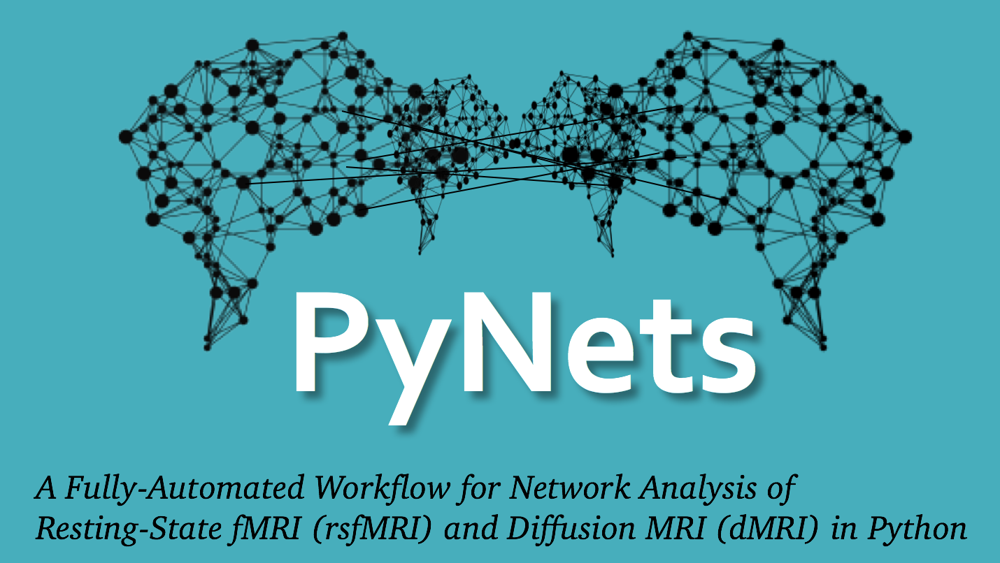
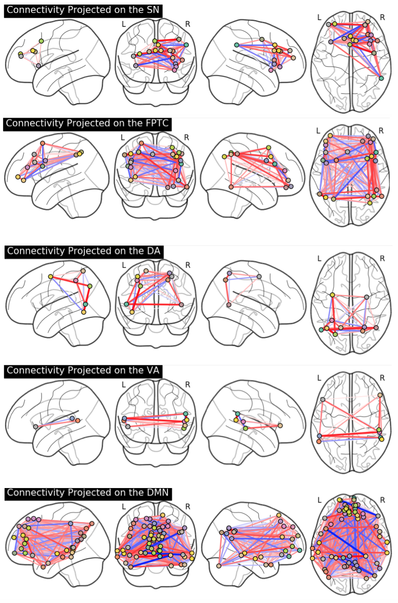

# PyNets



About
-----
A Python-Powered Workflow for Network Analysis of Resting-State fMRI (rsfMRI) and Diffusion MRI (dMRI)

Problem: A comprehensive, flexible, and fully-automated network analysis package for neuroimaging has yet to be implemented.

Solution: In PyNets, we harness the power of nipype, nilearn, and networkx python packages to automatically generate a range of graph theory metrics on a subject-by-subject basis. Uniquely, PyNets utilities can be integrated with ANY existing preprocessing workflow for your data.

Learn more about Nipype: http://nipype.readthedocs.io/en/latest/index.html

Learn more about Nilearn: http://nilearn.github.io/

Learn more about Networkx: https://networkx.github.io/

More specifically: PyNets utilizes nilearn and networkx tools in a nipype workflow to automatically generate rsfMRI networks (whole-brain, or RSN's like the DMN) and associated dMRI structural networks based on a variety of atlas-defined parcellation schemes, and then automatically plot associated adjacency matrices, connectome visualizations, and extract the following graph theoretical measures from those networks with a user-defined thresholding:\
global efficiency, local efficiency, transitivity, degree assortativity coefficient, average clustering coefficient, average shortest path length, betweenness centrality, degree pearson correlation coefficient, number of cliques \

-----

Walkthrough of the fully-automated pipeline:

Required User Inputs:

	-Subject's data- Any 4D preprocessed fMRI file or diffusion weighted image file with completed bedpostx outputs (in construction)
	-A subject ID (user-specified name of the directory containing the input data)
	-Any atlas (default is Power et al. 2011, 264-node parcellation scheme) or Bootstrap Analysis of Stable Clusters (BASC) for subject-level parcellation (in construction)
	-Graph or subgraph specification (i.e. Whole-brain or individual RSN's)

Step 1: PyNets models a functional connectivity matrix for the rsfMRI data (based on correlation, covariance, or sparse inverse covariance model fitting)

Step 2: PyNets models a structural connectivity matrix (in construction) for the dMRI data (based on probtrackx and resulting proportion of fibers between ROI coordinates used in Step 1, and constrained by FA and ventricular exclusion masking)

Step 3: PyNets creates connectome plots and adjacency matrices

Step 4: PyNets extracts network statistics for both functional and structural graphs (see above metrics)

Step 5: PyNets aggregates individual network data into a group database

Step 6: PyNets reduces dimensionality of nodal metrics at the group level (in construction) using cluster analysis and/or PCA

-----

1. Installation
```python
##Clone the PyNets repo and install dependencies
git clone https://github.com/dpisner453/PyNets.git
cd /path/to/PyNets
pip install -r requirements.txt

##If you run into any problems at run time, try installing the optional features of nipype with:
pip install nipype[all]
```

2. Usage:\
Situation A) You have a normalized (MNI-space), preprocessed functional rsfMRI image called "filtered_func_data_clean_standard.nii.gz" where the subject id=002, you wish to extract network metrics for a whole-brain network, using the 264-node atlas parcellation scheme from Power et al. 2011 called 'coords_power_2011':
```python
python /path/to/PyNets/pynets.py -i '/Users/dpisner453/PyNets_examples/002/filtered_func_data_clean_standard.nii.gz' -ID '002' -a 'coords_power_2011' -model 'corr'
```
&nbsp;&nbsp;&nbsp;&nbsp;&nbsp; Situation B) You have a normalized (MNI-space), preprocessed functional rsfMRI image called "filtered_func_data_clean_standard.nii.gz" where the subject id=s002, you wish to extract network metrics for the DMN network, using the 264-node atlas parcellation scheme from Power et al. 2011 called 'coords_power_2011' (currently the only atlas supported for extracting RSN networks in PyNets!), you wish to threshold the connectivity graph by preserving 95% of the strongest weights (also the default), you define your node radius as 3 voxels in size (also the default), and you wish to fit model with lasso sparse inverse covariance:
```python
python /path/to/PyNets/pynets.py -i '/Users/dpisner453/PyNets_examples/s002/filtered_func_data_clean_standard.nii.gz' -ID 's002' -a 'coords_power_2011' -n 'DMN' -thr '0.95' -ns '3' -model 'sps'
```

3. Viewing outputs:\
&nbsp;&nbsp;&nbsp;&nbsp;&nbsp; PyNets outputs network metrics into text files and pickled pandas dataframes within the same subject folder
in which the initial image or time-series was fed into the workflow. To open the pickled pandas dataframes
from within the interpreter, you can:
```python
import pandas as pd
##Assign pickle path for the covariance (as opposed to the sparse inverse covariance net)
pickle_path = '/Users/dpisner453/PyNets_examples/200/200_net_global_scalars_cov_200'
df = pd.read_pickle(pickle_path)
df
```

&nbsp;&nbsp;&nbsp;&nbsp;&nbsp; These dataframes can then be iteratively loaded and aggregated by row into a single dataframe, where there is 1 row per subject. Here is an example of what that code could look like (where 'frame' here is the aggregated df):
```python
import glob
import os
import pandas as pd
###
working_path = r'/work/04171/dpisner/data/ABM/network_analysis/' # use your path
name_of_network_pickle = 'FPTC_net_mets_inv_sps_cov'
atlas_name='Power 2011 atlas'
###

allFiles = []
for ID in os.listdir(working_path):
path_name = working_path + ID + '/' + atlas_name + '/' + ID + '_' + name_of_network_pickle + '_' + ID
if os.path.isfile(path_name):
print(path_name)
allFiles.append(path_name)

frame = pd.DataFrame()
list_ = []

for file_ in allFiles:
df = pd.read_pickle(file_)
list_.append(df)

frame = pd.concat(list_)

out_path = working_path + '/' + name_of_network_pickle + '_output.csv'
frame.to_csv(out_path)
```




Happy Netting!
